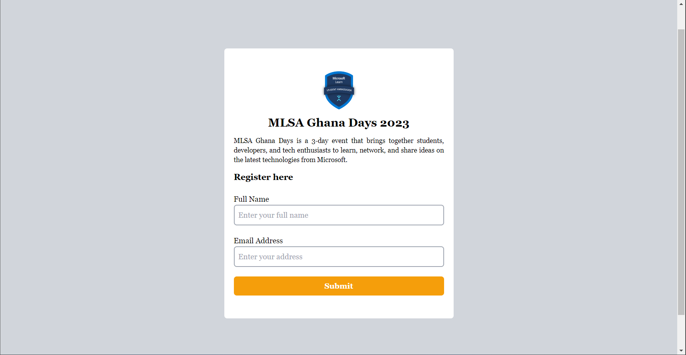
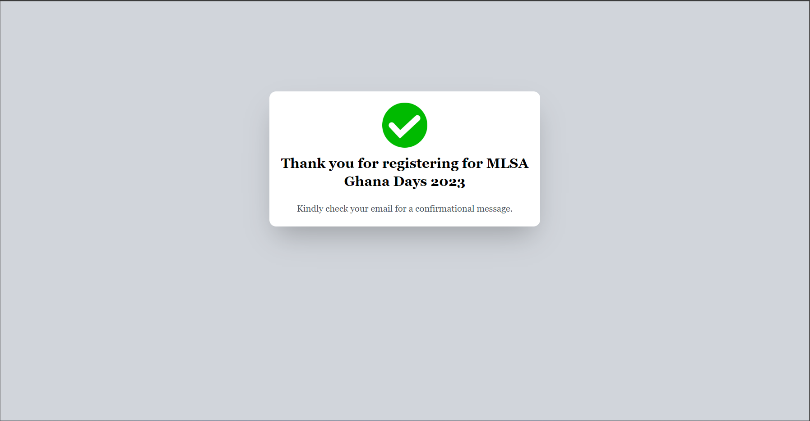
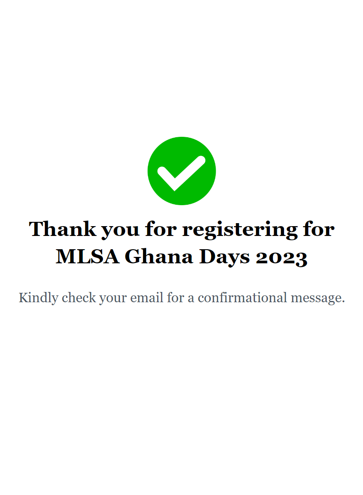

# Built a Registration Form in React JS with an API that Receives Data in Power Automate.

## Table of contents

- [Overview](#overview)
  - [The challenge](#the-challenge)
  - [Screenshot](#screenshot)
  - [Links](#links)
- [My process](#my-process)
  - [Built with](#built-with)
  - [What I learned](#what-i-learned)
  - [Continued development](#continued-development)
  - [Useful resources](#useful-resources)
- [Author](#author)
- [Acknowledgments](#acknowledgments)

**Note: Delete this note and update the table of contents based on what sections you keep.**

## Overview

### The challenge

Users should be able to:

- Your users should be able to:

1. View the optimal layout for the site depending on their device's screen size
2. See all countries from the API on the homepage
3. Search for a country using an input field
4. Filter countries by region
5. Click on a country to see more detailed information on a separate page
6. Click through to the border countries on the detail page
7. Toggle the color scheme between light and dark mode

### Screenshot

| **Home Page** | **Success Page** |
| ---------- | --------- |
|  | |
|  | |

| **Mobile View** | **Mobile View** |
| --------------------- | -------------------- |
|  |  |

### Links

- Live Site URL: [Deployed Site](https://mlsa-days-2023.vercel.app)

## My process

### Built with

- JSX
- [Tailwind CSS](https://tailwindcss.com/) - For styles
- Flexbox
- Desktop-first workflow
- [React](https://reactjs.org/) - JS library
- [Axios](https://axios-http.com/) - HTTP Request
- [React-router](https://reactrouter.com/) - For routing
- [React Hook Form](https://react-hook-form.com/) - For Form Validation and handling
- [Power Automate](https://learn.microsoft.com/power-automate?wt.mc_id=studentamb_158955) - For animations
- Microsoft Excel - For data Storage
- [Vercel](https://vercel.com/) - For deployment

 

### What I learned

I learned how to build the Power Automate flow to recieve data when a user submits the form. I used Axios to make HTTP requests to the API. I still looking for more ways to build Web Apps that leverages on APIs.

 

### Continued development
I still looking for more ways to build Web Apps that leverages on APIs. I will be building more projects that uses APIs.

 

### Useful resources

- [ChatGPT](https://chat.openai.com) - ChatGPT helped me get answers to my questions during development. And general errors I had during development.
- The official documentation for the libraries I used helped me alot.

## Author

- Website - [Prince Adimado's Blog](https://prince-adimado.hashnode.com/)
- Twitter - [@_primado](https://www.twitter.com/_primado)
- LinkedIn - [Prince Adimado](https://www.linkedin.com/in/primado/)

<!-- ## Acknowledgments

I would like to thank [Nathaniel Quansah](https://twitter.com/onihani) for his help during this project. -->

